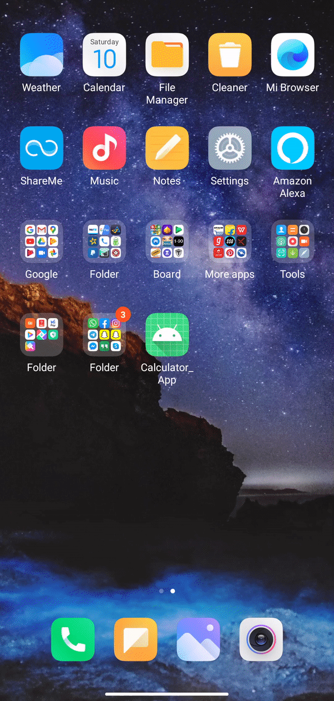

# HELLO-FOSS Scientific Calculator

Hello There!
This project is a part of HELLO-FOSS: Celebration of Open Source by the Web and Coding Club. We will be building a Scientific Calculator, similar to the one installed on our cellphones. The Repo has been given the label of "Hacktoberfest". Refer to [Hello-FOSS](https://github.com/wncc/Hello-FOSS) for guidelines.

## Getting Started

## Guidelines

Absolutely No Prerequisites for contributing to this Project.
We will be using Android Studio for our Project. If you are a beginner, you are advised to follow this article on [Android Studio](https://www.wncc-iitb.org/wiki/index.php/Android_Studio) for basic set up and building your first App. We will be following the same code as given in the article. 
Note:  Do update the "Updates on the Project" of this ReadMe.md file after every contribution you make.

## Problem Statement

The main intention of this project is to build a fully-functional Scientific Calculator Application. The App should support basic calculations, PEDMAS rules and perform scientific calculations, trigonometric functions. We can add a "Quadratic equation" solver functionality to our Application as well.

## Updates on The Project

The Basic Application is Ready. It can perform multiple additions,subtractions,divisions and multiplications of integers as well as decimals.

## What can you Contribute to?

- Fix Bugs: For Example the button '3' is not clickable. On pressing 9, the application takes the input as six. This needs to be fixed.

- App Crahes: Right Now, The App crashes a lot of times. For Example if you try calculating 2* and without giving the second paprameter try calculating it, the App crashes. We need to handle such app crashes by giving warnings and alerts. This is an interesting part to work on. Try debugging the code with loads of print statements. 

- Scientific Calculations: The App only performs basic calculations as of now. We need to add the advanced features. You need to create a new Activity, such that users can  navigate to the activity using a button or a dropdown icon(preferable). Use the inbuilt Java Math Functions like sin,pow. Design an Algorithm for PEDMAS rule. Here's a [tutorial](https://www.youtube.com/watch?v=taEpczciQXk&feature=youtu.be) which can help you.

- Quadratic Equation Solver: (Real + Imaginary Roots) What if you input p and q from the equation : x2+px+q and get the two roots(real as well as imaginary) as the output. This is again an interesting part to contribute to. Designing the Algorithm here is the real fun. Again, you will have to create a new Activity, such that users can navigate to this activity using a button or a dropdown icon(preferable).

- Working on the UI: The User Interface of the Application looks dullish at the moment. Adding Various Color themes to the application would be encouraged. You can give users variety of options to choose from. Exmaples: Dark Themes, Rainbow Theme. Here's a video which can help: [Dark theme](https://www.youtube.com/watch?v=QhGf8fGJM8U). Put on your creative caps here and come out with great app themes. Try exploring the different options in xml codes.

- App Icon: The present App Icon which is a default icon provided by Android Studio has to be replaced by a new one. You can simply download from internet or create a new one, edit the manifest files. Here's how to do it. [App Icon](https://stackoverflow.com/questions/26615889/how-do-you-change-the-launcher-logo-of-an-app-in-android-studio)

- If you have want to work on any additional feature, you are welcome to do that. You can send a Pull Request along with a commit to update the ReadMe.md file.

Join our [Discord](https://discord.com/invite/mzhyrvS) for discussing your doubts.

***

Created with :heart: by <a href="https://www.wncc-iitb.org/">WnCC</a>

